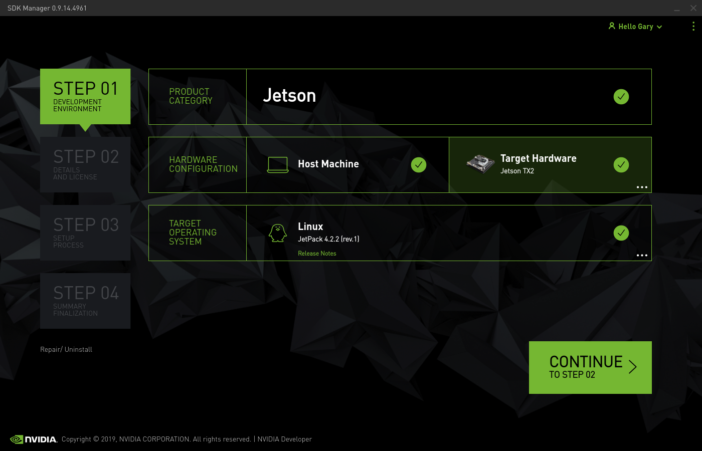
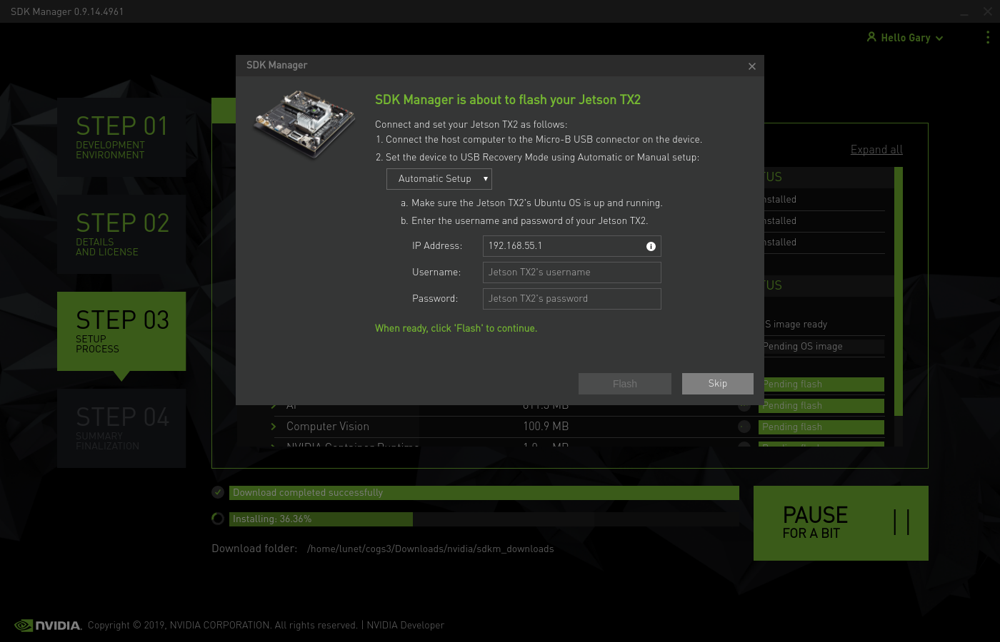

## Guide for installing the Nvidia JetPack 4.2 on the Aetina Ace-n510 with Jetson TX2. ##

Using Nvidia SDK Manager choose TX2 and Jetpack 4.2.

**Step 1 - Install L4T and SDK packages**
Use the [Nvidia SDK Manager](https://developer.nvidia.com/nvsdk-manager) to install required JetPack Version 4.2. Follow the instructions as per the SDK Manager. For info  ~/$USER/Downloads/Nvidia is the defualt location to download all packages and files that make up the specfic JetPack distribution. ~/Nvidia/... is the default path for creating the OS image that is flashed to the TX2.

If using a Nvidia TX2 Dev Kit just following the SDK Manager, if using a Aetina N510 do not flash the TX2 as the image needs to be patched as instructed below. 

**Step 1a - Only Required if Using the Aetina N510 TX-2**
Download patch files from [Aetina](https://www.aetina.com/support-download.php?t=4&p1=86&p2=87) note at time of writing they only have a patch for JetPack 4.2, not 4.2.1 or 4.2.2.

It is imprtant that you do connect TX2 and coomence flashing until the specific patches downloaded from Aetina have been copied over the corresponding files in the OS Image.
Once copying is completed put the TX2 into recovery mode and allow the SDK manager to flash the TX2 and then install the revelvant software packages as prompted by the SDK Manager.

**Step 2 - Patch the Kernel**
Clone the scripts from [this Github repo](https://github.com/Tengyun-Mo/buildLibrealsense2TX2). Note that this installs Realsense SDK 2.20.0. At the time of writing 2.28.0 is the most current version of the SDK and is the version I installed on our TX-2. To instal your desired version edit the LIBREALSENSE_VERSION parameter in both buildPatchedKernel.sh and installLibrealsense.sh. Then simply follow the guide provided by the author on GitHub.

